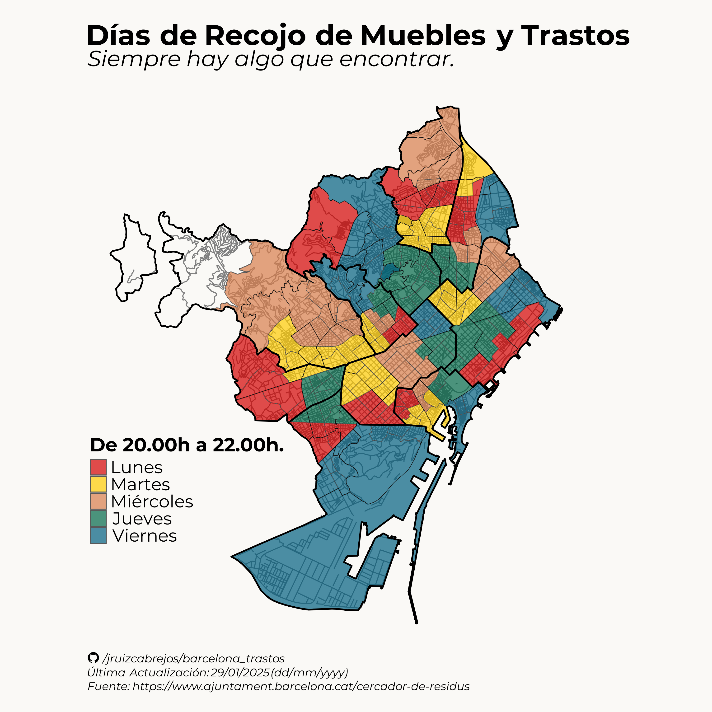

# Mapa de Trastos y Muebles Días de Recogida en Barcelona, España 

Entrada completa del blog en: https://jruizcabrejos.com/post/accessible-frugality-barcelona-trash-collection-data-20250201/

*Viñeta del webcómic [Emmy the Robot](https://www.webtoons.com/en/canvas/emmy-the-robot/list?title_no=402201) de Dominic Cellini*

## Agradecimiento

Inspirado en [el mapa de Google de Zara Patterson de 2010](https://www.google.com/maps/d/u/0/viewer?mid=1l2VAhplHwkWYhNi6WOcDeqnxPoE&ll=41.38994767203882%2C2.1714785646320367&z=13&fbclid=IwAR0Nz0oQug6qn9cU2yfmNpWFeOKMcscwQf2-Gp2Oiks0WavhvUgzlui5_FE) y en su web https://caerengracia.wordpress.com/, en el que ["enumera recursos para llevar a cabo trabajos de restauración y renovación de forma ecológica"](https://caerengracia.wordpress.com/eco-recursos/).

## Introducción

"¿Dónde y cuándo puedo encontrar muebles viejos y abandonados en Barcelona?"

Esta es una pregunta que mis amigos, amigos de amigos, compañeros de trabajo y yo nos hemos hecho de vez en cuando (por improbable que suene).

Por desgracia, el único mapa disponible fue actualizado por última vez en 2016 (originalmente hecho por Zara en 2010).

Como no pude encontrar un mapa **completo** de Barcelona con los días de la semana en los que se recogen los muebles/trastos (¿basura?), he recopilado los datos de la web del Ajuntament y he hecho mis propios mapas.

Ahora son tuyos.

Buena caza.

## Mapas

Los datos en "crudo" se pueden encontrar en este repositorio.

## Notas

Es un milagro que el mapa de Zara haya sobrevivido durante tanto tiempo en un servicio de Google, [a diferencia del destino de muchos otros servicios que se han ido discontinuando con el tiempo.](https://www.theverge.com/2019/11/26/20977968/google-graveyard-products-shut-down-dead-not-supported-discontinues-spring-cleaning/archives/3)

También es cierto que hay _algunos_ recursos por "ahí", similares a lo que he hecho aquí. Sin embargo, tienen varias limitaciones:

- El Ayuntamiento de Barcelona solo proporciona información sobre los días de recogida de trastos [para cada calle de forma individual.](https://ajuntament.barcelona.cat/cercador-de-residus/ca)

- La otra alternativa son mapas para cada distrito por separado[(1)](https://ajuntament.barcelona.cat/horta-guinardo/es/noticia/muebles-y-trastos-viejos-el-dia-que-toca-3_1345274),[(2)](https://ajuntament.barcelona.cat/lescorts/es/noticia/mobles-i-trastos-vells-el-dia-que-toca-2_1346730),[(3)](https://ajuntament.barcelona.cat/gracia/ca/noticia/muebles-y-trastos-viejos-el-dia-que-toca-2_1345185). Algunos de ellos tienen presentaciones diferentes [(4)](https://ajuntament.barcelona.cat/santmarti/ca/noticia/desfer-se-de-mobles-i-trastos-vells-el-dia-que-toca-1344869), lo que hace difícil cualquier "costura" manual.

- Lo mismo ocurre con otros mapas individuales hechos para distritos concretos (p. ej. [GeoBioCat](https://geobiocat.blogspot.com/2017/04/mapa-dia-dels-mobles-leixample.html))
